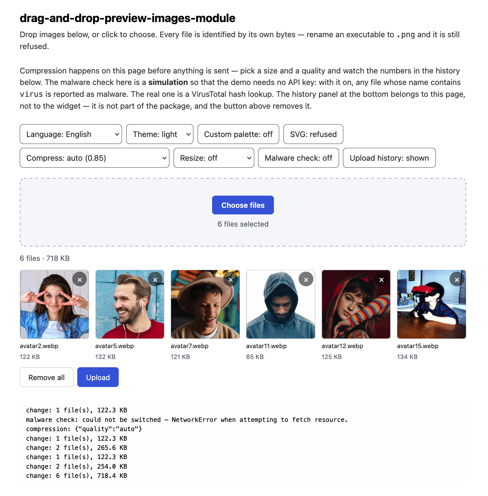

# drag-and-drop-preview-images-module

An image drop zone with previews: a front-end widget with no dependencies and a Node
upload handler with no framework.

Drop files on it, or pick them the ordinary way, and each one appears as a thumbnail with
its size and a button to take it out again. Pictures fill in one at a time as they decode,
so a large selection shows the first thumbnail immediately instead of a grid of empty
squares. Without a server endpoint the widget is still just a form field — the files ride
along with the form and the back end sees no difference. Give it an endpoint and it posts
them itself, with a progress bar and a working cancel button.

What it is careful about:

- **A file is what its bytes say it is.** The name and the type the browser reports are
  both the operating system guessing from an extension; renaming an executable to `.png`
  is enough to fool either. Both halves read the leading bytes instead. The client's check
  exists to give the user a reason; the server's is the one that counts, because anything
  reachable over HTTP can be sent with curl and no browser at all.
- **The server refuses names rather than repairing them.** Traversal in any spelling, NUL
  bytes, Windows device names, trailing dots — a name that has to be rewritten to become
  safe usually belongs to an attempt.
- **Nothing half-written is left behind.** Each upload goes to a temporary name and is
  renamed only once it is whole, and a request that dies part-way through is cleaned up
  rather than leaving a stray file on disk.
- **A cross-origin form cannot post into the endpoint.** `multipart/form-data` is not
  preflighted, so without an Origin check any page on any site could upload under the
  user's session cookie.

Three larger pieces are there when you want them, and absent when you do not. Each is one
option block; leave it out and that code never runs:

- **[Shrink pictures before they are sent](#shrinking-pictures-before-they-are-sent)** —
  resize to a box, re-encode at a quality you choose, or drop metadata without touching a
  pixel. It happens on the page, so the bytes saved never travel at all.
- **[File uploads under a session](#sessions-who-uploaded-what)** — a folder per visitor
  and an owner on every answer, using whatever your application already uses to tell one
  visitor from another, including anonymous ones.
- **[Screen uploads for malware](#screening-uploads-for-malware)** — a VirusTotal hash
  lookup, or your own scanner. Only a hash leaves your server; the file does not.
- **[Try again after a failure](#trying-again-after-a-failure)** — automatically, or on a
  button, and only for the failures that are about the connection rather than the file.

Size and shape: 13 KB of JS and 2 KB of CSS gzipped on the page, zero runtime
dependencies. The server half is a single `(req, res)` function that mounts in Express,
AdonisJS, Fastify, Nest or bare `node:http`, and its only dependency is a multipart
parser. Five languages ship with it — English (the default), Ukrainian, Spanish, German
and French — and light and dark themes, with colours, fonts and metrics all settable at
integration time.

> 🇺🇦 [Ця сторінка українською](README.uk.md)



---

## Status

Work in progress, and not published to npm yet. Until it is, install it from the
repository:

```bash
npm install github:Insider515/drag-and-drop-preview-images-module
```

Or clone it and try the demo:

```bash
git clone https://github.com/Insider515/drag-and-drop-preview-images-module.git
cd drag-and-drop-preview-images-module
npm install
npm start          # builds the demo and serves it on http://127.0.0.1:5173
```

---

## Quick start

### As a form field — no server changes at all

Leave `endpoint` unset and the widget stays what it replaced: an `<input type="file">`
with previews. The files ride along with the form, and your existing back end sees no
difference.

```html
<form action="/contact" method="post" enctype="multipart/form-data">
  <div id="images"></div>
  <button type="submit">Send</button>
</form>
```

```js
import { DropPreview } from 'drag-and-drop-preview-images-module';
import 'drag-and-drop-preview-images-module/style.css';

new DropPreview('#images', { name: 'images[]' });
```

### Uploading on its own

```js
const drop = new DropPreview('#images', {
  endpoint: '/api/upload',
  autoUpload: true,
});

drop.on('uploaded', ({ answer }) => console.log(answer.uploaded));
```

```js
// server
import express from 'express';
import { createUploadHandler } from 'drag-and-drop-preview-images-module/server';

const app = express();
app.use('/api/upload', createUploadHandler({ root: './uploads' }));
app.listen(3000);
```

---

## What it does

| | |
| --- | --- |
| Previews | Thumbnails drawn from the files themselves, with name and size |
| Selective removal | Each tile has its own remove button; "Remove all" clears the queue |
| Drag & drop | Onto the zone, with the highlight surviving the pointer crossing child elements |
| Identification | The type is read from the file's leading bytes, never from the extension |
| Limits | Per file, per queue, file count, and decoded pixels |
| Upload | Progress and cancellation, or none at all if you keep it a form field |
| Languages | Five shipped; your own is an object with a dictionary |
| Themes | Light and dark, following the system or forced; every colour a CSS variable |
| Two on one page | Nothing is registered globally, so instances do not interfere |
| Compression | Resize, re-encode, or strip metadata losslessly — on the page, before sending |
| Sessions | A folder per visitor, and who uploaded what in the answer |
| Malware screening | A hash lookup, so the file itself never leaves your server |
| Retrying | A dropped connection is sent again; a refused file is not |

---

## Widget options

```js
new DropPreview(target, {
  endpoint: null,         // POST here; null keeps it a plain form field
  name: 'images[]',       // form field name
  fields: null,           // extra form fields sent with an upload
  headers: null,          // object or function — for authorisation tokens
  credentials: 'same-origin',

  accept: [],             // MIME types; empty means every image format known
  allowSvg: false,        // SVG is XML that can carry script; opt-in
  limits: null,           // see below
  compress: null,         // shrink pictures before sending; see below
  retry: null,            // send a failed upload again; see below
  filesPerRequest: 1,     // files in one request; 0 sends the whole queue at once

  autoUpload: false,      // upload as soon as files are chosen
  showUploadButton: true,
  showClearButton: true,

  locale: null,           // 'en' | 'uk' | 'es' | 'de' | 'fr' | your dictionary
  theme: null,            // colours, fonts, metrics
  colorScheme: 'auto',    // 'auto' | 'light' | 'dark'
});
```

`target` is an element or a CSS selector.

### Limits

```js
new DropPreview('#images', {
  limits: {
    maxFileSize: 10 * 1024 * 1024,   // bytes per file
    maxFiles: 20,                    // files in the queue
    maxTotalSize: 100 * 1024 * 1024, // bytes for the whole queue
    maxPixels: 50 * 1024 * 1024,     // pixels a preview may decode
  },
});
```

`maxPixels` is not about tidiness. A 30 KB PNG can declare 40000×40000 and cost several
gigabytes once decoded — the tab dies before anything is uploaded. The dimensions are only
knowable after the browser has parsed the header, so the check happens when the preview is
built, and a file past it is dropped with a reason.

### Methods and events

```js
await drop.add(fileList);        // same checks as picking them by hand
drop.remove(id);
drop.clear();
await drop.upload();
drop.cancel();
drop.destroy();

drop.files;                      // the queue, as plain objects
drop.totalBytes;
drop.busy;

drop.on('change',   ({ files }) => {});
drop.on('rejected', ({ rejected }) => {});   // [{ file, code, detail }]
drop.on('uploaded', ({ answer, files }) => {});
drop.on('error',    ({ error, code, message }) => {});
```

`on()` returns a function that unsubscribes.

A refusal carries a `code`, never a sentence, so you can branch on it. To show it to
someone, `drop.describeError(code, detail)` turns it into text in the active language.

---

## Language

```js
new DropPreview('#images', { locale: 'de' });
```

Accepts `'en'`, `'uk'`, `'es'`, `'de'`, `'fr'`, or a full tag whose base matches one of
them (`'de-AT'` gives German). Anything unrecognised gives English rather than an error.

Plurals follow the language's own rule — Ukrainian has three forms, the rest have two —
and size units become local (`1.5 Ko` in French). The widget's root gets a `lang`
attribute.

### Your own language

Partial dictionaries are fine: anything left out comes from English.

```js
import { DropPreview, PLURAL_RULES } from 'drag-and-drop-preview-images-module';

new DropPreview('#images', {
  locale: {
    id: 'sv',
    name: 'Svenska',
    tag: 'sv',
    plural: PLURAL_RULES.default,
    strings: {
      'drop.button': 'Välj filer',
      'drop.hint': 'eller dra dem hit',
      'count.files': { one: '{n} fil', other: '{n} filer' },
    },
  },
});
```

The shipped dictionaries are ordinary exports (`import { en, uk } from '…'`), and in the
repository they live in `src/locales/` — one plain object per language. A test keeps the
key sets identical across all five and refuses a translation that introduces a
placeholder English does not have.

---

## Appearance

Pass nothing and the widget looks the way the demo does.

```js
new DropPreview('#images', {
  colorScheme: 'auto',      // 'auto' follows the system; 'light'/'dark' force it
  theme: {
    font: "'Inter', system-ui, sans-serif",
    fontSize: '15px',
    radius: '2px',
    tileSize: '140px',
    gap: '16px',
    dropHeight: '160px',

    colors: { accent: '#7c3aed', accentHover: '#6d28d9' },
    light: { bg: '#fffdf7', text: '#2b2415' },
    dark: { bg: '#0b1020', accent: '#a78bfa' },
  },
});
```

`colors` applies to both schemes; `light` and `dark` narrow it. Theme only the light
scheme and the dark one keeps its built-in colours — a white background will not appear at
night.

**Colours:** `bg`, `bgSubtle`, `bgSunken`, `border`, `borderStrong`, `text`, `textMuted`,
`accent`, `accentHover`, `accentSoft`, `accentContrast`, `danger`, `dangerHover`,
`success`, `warning`, `shadow`, `overlay`.

**Fonts and metrics:** `font`, `fontSize`, `radius`, `radiusLarge`, `tileSize`, `gap`,
`dropHeight`.

An unknown key throws rather than being ignored. A key starting with `--` passes straight
through, for a variable the named list has not caught up with. Values are checked:
anything that could close the rule and open one of its own (`;`, `}`, `url(`, comments) is
refused — which matters if your colours come from your own users.

A theme applies to one widget, so two on a page can look different.

---

## Where you can mount the server

`createUploadHandler()` returns a plain `(req, res)` function over node's own objects.
`basePath` is the prefix to strip when the host does not rewrite `req.url` itself —
Express does, Adonis and `node:http` do not.

```js
// Express
app.use('/api/upload', createUploadHandler({ root: './uploads' }))

// AdonisJS
const files = createUploadHandler({ root: app.makePath('uploads'), basePath: '/api/upload' })
router.any('/api/upload/*', ({ request, response }) => files(request.request, response.response))

// Fastify
fastify.all('/api/upload/*', (req, reply) => files(req.raw, reply.raw))

// bare node:http
http.createServer(files).listen(3000)
```

### Handler options

```js
createUploadHandler({
  root: './uploads',        // required; the one directory files may land in
  basePath: '',             // prefix to strip from the URL
  field: 'images[]',        // form field to read — the widget's default

  accept: [],               // MIME types; empty means every image format known
  allowSvg: false,
  onConflict: 'rename',     // 'rename' | 'refuse' | 'overwrite'
  rename: null,             // (name, { type }) => string — choose the stored name

  limits: {
    maxFileSize: 10 * 1024 * 1024,
    maxFiles: 20,
    maxRequestSize: 100 * 1024 * 1024,
    maxPixels: 50 * 1024 * 1024,      // pixels a picture may declare; 0 turns it off
    minFreeSpace: 64 * 1024 * 1024,
  },
  maxConcurrent: 8,         // uploads in flight; beyond that, 503

  allowedOrigins: undefined, // same-origin only by default; false disables the check
  authorize: (req, ctx) => true,
  onWarning: (message, detail) => {},
});
```

### What comes back

```json
{
  "uploaded": [{ "name": "photo.png", "original": "photo.png", "size": 1024, "type": "image/png" }],
  "failures": [{ "name": "evil.png", "code": "NOT_AN_IMAGE", "error": "…", "params": null }],
  "fields": { "album": "holiday" }
}
```

One bad file does not fail the batch. The client is told which ones did not make it and
why, and keeps the rest.

### Just the storing half

`UploadService` does the filesystem work and knows nothing about HTTP, for a framework
that parses the multipart body itself:

```js
import { UploadService } from 'drag-and-drop-preview-images-module/server';

const service = new UploadService({ root: './uploads' });
const stored = await service.store(filename, readableStream);
```

---

## Shrinking pictures before they are sent

Off by default. Turn it on with a `compress` block on the widget:

```js
new DropPreview('#images', {
  compress: {
    maxWidth: 128,
    maxHeight: 128,
    quality: 'auto',
  },
});
```

Remove the block and files are queued exactly as they came. All of this happens on the
page with the canvas the browser already has, so nothing is added to the bundle and the
bytes saved never travel at all.

### What can honestly be promised, and what cannot

**This is where a dependency-free build runs out of road, so read this before choosing
settings.**

| | Available here | |
|---|---|---|
| Resizing | **yes** | The canvas does it |
| Lossy re-encoding | **yes** | `toBlob` takes a quality |
| Dropping metadata | **yes, and exactly** | The picture is copied byte for byte; only EXIF, XMP, IPTC, comments and timestamps are removed |
| Lossless *recompression* | **no** | Squeezing a JPEG without touching its pixels needs a codec, and a codec is a dependency |

So `quality: 'lossless'` here means **metadata only**. It is not a smaller re-encode, and
the module will not pretend otherwise: it never touches a canvas on that path, because a
canvas decodes to pixels and encodes again, which for a JPEG loses a little every time —
even at quality 1.

Metadata alone is worth more than it sounds. A photograph off a phone routinely carries a
kilobyte of camera settings and GPS, plus an embedded thumbnail that can run to tens of
kilobytes. All of it invisible, all of it uploaded, and some of it — where the picture was
taken — nobody meant to publish.

### `quality: 'auto'` is 0.85

Fifteen percent off the top of the scale, which is what "no more than 15%" can honestly
mean with nothing to compare against. It is the encoder's dial, not a measured perceptual
difference — there is no way to measure that here without a codec to measure against.

Set a number yourself if you want something else: `quality: 0.6`.

**It does nothing to a PNG.** PNG has no quality dial; a browser ignores the argument. To
make a PNG smaller, resize it or convert it:

```js
compress: { maxWidth: 1600, format: 'image/webp' }   // usually a large saving
```

### The settings

| Setting | Default | What it does |
|---|---|---|
| `maxWidth`, `maxHeight` | — | The box to fit inside. Either on its own is enough |
| `fit` | `'contain'` | `'contain'` fits inside the box, `'cover'` fills it |
| `quality` | `'auto'` | `'auto'` (0.85), a number, or `'lossless'` (metadata only) |
| `format` | `'auto'` | `'auto'` keeps the format; or `image/jpeg`, `image/png`, `image/webp` |
| `stripMetadata` | `true` | Drop EXIF, XMP, IPTC, comments |
| `skipIfLarger` | `true` | Keep the original when the new file is not actually smaller |

A picture already inside the box is left at its own size — enlarging adds bytes and invents
detail that was never there.

### Three things it refuses to do

**It will not send you a bigger file.** A PNG straight from an optimiser is usually smaller
than anything a canvas produces from the same pixels, so the re-encode is measured and
thrown away if it lost. Turn that off with `skipIfLarger: false` if you would rather have
the uniform format.

**It will not lay your photographs on their side.** Phone cameras record which way up they
were held in an EXIF tag, and browsers turn the picture by it. Stripping that tag rotates
every portrait photo. So on the metadata-only path, EXIF carrying an orientation other than
"upright" is **kept**; on the re-encode path it is dropped safely, because the canvas has
already baked the rotation into the pixels.

**It will not lose a file because compressing it failed.** Every failure — a canvas that
throws, a format the browser cannot encode, a picture that would not decode — ends with
the original being sent, and a `warning` event you can listen to:

```js
drop.on('warning', ({ code, error }) => console.warn(code, error));
```

### What it costs

Compression runs after a file has passed the limits, one picture at a time, using the same
decoded image the preview already made — nothing is decoded twice, and the decoded copy is
released as soon as it has been used. Note the order: a file over `maxFileSize` is refused
**before** anything tries to shrink it. Raise the limit if you want large originals accepted
and then made small.

The queue reports both sizes, so you can show the saving:

```js
drop.on('change', ({ files }) => {
  for (const f of files) console.log(f.name, f.originalSize, '->', f.size);
});
```

---

## Trying again after a failure

Off by default: one failure is the end of it, and the tiles say why.

Turn it on with a `retry` block and a failed upload is sent again by itself:

```js
new DropPreview('#images', {
  endpoint: '/upload',
  retry: { attempts: 3 },
});
```

There is also a button and a method, and both work whether or not the block is there.

### It repeats the failure, not the file

A failed upload is two different things, and treating them alike makes a retry button
either useless or annoying:

| | |
|---|---|
| **Worth repeating** | `NETWORK`, `INTERNAL`, `BUSY`, `SCAN_FAILED`, `NO_SPACE`, and any `HTTP_ERROR` with a 5xx status |
| **Not** | `TOO_LARGE`, `NOT_AN_IMAGE`, `TYPE_NOT_ALLOWED`, `INFECTED`, `INVALID_NAME`, `DENIED`, a 4xx — and `ABORTED`, because that was the person's own decision |

The connection dropping is about the moment. The file being too large is about the file:
sending it again produces the same refusal, more slowly, and buries the reason under a
spinner. So only the first kind is repeated, and the second keeps its explanation on the
tile.

In a mixed batch this matters. Two files fail, one because the gateway answered 502 and one
because it is a text file with a `.png` name — only the first goes back on the wire.

### The settings

| Setting | Default | What it does |
|---|---|---|
| `attempts` | `3` | Attempts in total, counting the first |
| `delay` | `1000` | Milliseconds before the second attempt |
| `backoff` | `2` | What each wait is multiplied by |
| `maxDelay` | `30000` | The longest any single wait may be |

With the defaults the waits are **1 s, 2 s, 4 s, 8 s…** Each one is longer than the last
on purpose: a server having a bad minute stays down for a moment, and a crowd of browsers
hammering it at a fixed interval is how one bad minute becomes several.

While it waits, the status line says so — "Upload failed — trying again (2 of 3)", in the
widget's language — and **Cancel cuts the wait short**. A cancel that appeared to be ignored
for the length of a 30-second backoff would be worse than no retry at all.

### A mass upload survives an interruption

Files travel **one per request**, so what has landed stays landed. Put fifty photographs in
a single request and a connection that drops on the forty-ninth loses all fifty — and the
ones the server had already written stay on its disk, so sending the batch again leaves
duplicates of every one of them. Measured, before this was the default: ten files, the line
cut after six, retry the batch — fifteen files on the server, five of them duplicates.

Now the same interruption costs the file that was in flight and nothing else:

```
12 queued, connection cut after 7
  tiles: 7 done, 1 error, 4 ready
  server: 7 files

press Retry
  server: 12 files, no duplicates
```

A file marked `done` is never sent again — not by Upload, not by Retry, not by anything.
That is what makes the second attempt cheap.

| Setting | Default | What it does |
|---|---|---|
| `filesPerRequest` | `1` | Files in one request. Raise it to trade safety for fewer round trips; `0` puts the whole queue in one request, the way earlier versions did |

**A dropped connection stops the walk.** The remaining files would fail the same way, one
after another, and watching forty of them do it slowly helps nobody. A *refusal* of one
file does not stop it: that the third is not an image says nothing about the fourth.

The progress bar measures the whole queue rather than the request in flight — otherwise it
would snap back to nothing on every file — and the status line counts files, not requests:
"Uploading 3 of 20".

### The button, and doing it yourself

A **Retry** button appears beside Upload once something has failed for a reason worth
repeating, and goes away again when there is nothing to repeat. A button that is always
there but usually pointless teaches people to ignore it.

The same thing from code:

```js
if (drop.retryable) await drop.retry();
```

`retry()` re-queues only what is worth repeating and sends it; with nothing to repeat it
returns `null` and makes no request.

### Watching it happen

```js
drop.on('retry', ({ attempt, of, delay, code }) =>
  console.log(`attempt ${attempt} of ${of} in ${delay} ms, after ${code}`));
```

The `error` event fires **once**, after the last attempt — not once per attempt.

### What it does not do

It resumes between files, not inside one. A 10 MB photograph that failed at 90% starts
over — only that photograph, not the twenty around it. Resuming inside a file needs the
server to hold partial uploads and agree on a protocol for them, which is a larger thing
than this package is.

---

## Sessions: who uploaded what

Off by default. The endpoint knows nothing about visitors, every file lands in one
directory, and nothing records who put it there.

Turn it on by passing a `sessions` block. Your application already knows how to tell one
visitor from another — a login, or a cookie an anonymous visitor carries — and that is the
only part you supply:

```js
createUploadHandler({
  root: './uploads',
  sessions: {
    identify: (req) => req.session?.id ?? null,
  },
});
```

Now each session gets its own subdirectory, and the answer says which:

```
uploads/
  1f3c…a9/photo.png      ← Anna
  7b2e…04/photo.png      ← Borys, same file name, no collision
```

```json
{ "owner": "1f3c…a9",
  "uploaded": [{ "name": "photo.png", "original": "photo.png", "size": 51234,
                 "type": "image/png", "owner": "1f3c…a9" }] }
```

Remove the block and everything goes back to one shared directory. Nothing else changes.

### The three settings

| Setting | Default | What it does |
|---|---|---|
| `identify(req)` | — | Returns the id. Sync or async. This is the only required part |
| `scope` | `'directory'` | `'directory'` — a folder per session; `'label'` — one flat folder, ownership only reported |
| `required` | `true` | No session → 403 `NO_SESSION`. Set `false` to let those fall back to the shared root |

Use `'label'` when you keep files flat and record ownership in your own database:

```js
sessions: { identify: (req) => req.session.id, scope: 'label' }
```

The id then never touches the filesystem, so it can be anything — `user/42+ok` is fine.

### What the module checks, and what it will not do for you

With `scope: 'directory'` the id becomes a folder name, and it usually comes from a cookie
— which is to say from the client. So it is checked exactly as strictly as a file name,
and it has to be a single usable segment already:

| The hook returns | What happens |
|---|---|
| `"1f3ca9"` | `uploads/1f3ca9/` |
| `"../escape"`, `".."`, `"/etc"`, `"a/b"` | 400 `INVALID_SESSION` |
| `"CON"`, `"x\0y"`, 300 characters | 400 `INVALID_SESSION` |
| `null`, `""` | 403 `NO_SESSION`, or the shared root with `required: false` |
| the hook throws | 500, and the reason is logged through `onWarning`, not sent to the client |

**It is refused, not repaired.** `/etc` is not quietly turned into `etc`, and `a/b` is not
turned into `b` — that is how two different sessions would end up sharing one folder.
If your session ids are base64 or otherwise not folder-shaped, hash them yourself:

```js
identify: (req) => createHash('sha256').update(req.session.id).digest('hex').slice(0, 32),
```

A session that cannot be established stops the request **before the body is read**, so a
visitor with nowhere to put files does not get to stream megabytes at your disk first.

### On the page

Nothing to configure: the widget posts to your endpoint with the cookie attached, which is
what `credentials: 'same-origin'` already does. Two cases need a word:

```js
// The endpoint is on another origin, and the session lives in a cookie.
new DropPreview('#images', { endpoint: 'https://api.example.com/upload', credentials: 'include' });

// The session travels as a token rather than a cookie.
new DropPreview('#images', { endpoint: '/upload', headers: () => ({ Authorization: `Bearer ${token()}` }) });
```

`headers` takes a function so the token is read at the moment of upload, not at the moment
the widget was built — which matters for a token that is refreshed.

### Naming files per session

`rename` is told which session it is naming for:

```js
rename: (name, meta) => `${meta.identity}-${Date.now()}-${name}`,
```

`meta.identity` is `null` when sessions are off, or when `required: false` let an
anonymous visitor through.

---

## Screening uploads for malware

Off by default. Turn it on with a `scan` block, using your own API key:

```js
createUploadHandler({
  root: './uploads',
  scan: {
    service: 'virustotal',
    apiKey: process.env.VT_API_KEY,
  },
});
```

Remove the block and nothing is screened. No dependency is added either way — the lookup
uses the `fetch` and the SHA-256 that Node already has.

### Read this before you rely on it

**Only a hash is sent. The file is not.** The check is a lookup of the file's SHA-256, so
nothing leaves your server that could be turned back into a customer's photograph.

That choice decides what the feature can do, and the limitation is the point:

> It recognises malware that somebody has already reported. It does not examine the file.
> A sample created this morning is unknown to it.

This is worth having — known samples are most of what actually arrives — and it is **not**
a substitute for a scanner that reads the bytes. If you need one, pass `check` instead and
talk to ClamAV over its socket, or to whatever your organisation already runs. Everything
below applies to your scanner too.

### Where it happens

After the bytes are on disk under a temporary random name, and **before** the file is
given its real one. A file that is refused never existed under a name anything could
serve, and its temp copy is deleted. A file refused earlier for another reason — wrong
type, over the limit — is never sent to the scanner at all, so it costs no round trip.

### The settings

| Setting | Default | What it does |
|---|---|---|
| `service` | — | `'virustotal'`, the only one built in |
| `apiKey` | — | Required by that service |
| `check(file, signal)` | — | Your own scanner instead; gets `{ sha256, name, type, size }` |
| `onUnknown` | `'accept'` | What to do with a file the database has never seen |
| `onError` | `'reject'` | What to do when the check itself fails |
| `timeoutMs` | `5000` | How long one check may take |

**`onUnknown` defaults to `accept`** because almost nothing an ordinary person uploads has
ever been reported to a malware database. `'reject'` would turn away nearly every real
photograph.

**`onError` defaults to `reject`** for the opposite reason. If you asked for screening and
the screening did not happen, accepting anyway means believing you are protected while you
are not — and nothing on screen would say otherwise. Set `'accept'` if you would rather
keep uploads working through an outage, knowing what you are trading away.

### The failure you will actually meet

VirusTotal's free tier allows **four lookups a minute**. Past that it answers 429, which
with the default `onError` means uploads are refused with `SCAN_FAILED` until the minute
is out. On a public form that is a queue of angry users, so before turning this on in
anger: check your plan's rate, keep `maxFiles` modest, or put screening behind your own
queue with `check`.

### What the visitor sees

| Code | HTTP | The message, in the widget's language |
|---|---|---|
| `INFECTED` | 422 | The file was reported as malware |
| `NOT_SCREENED` | 422 | The file could not be checked for malware (only with `onUnknown: 'reject'`) |
| `SCAN_FAILED` | 503 | The malware check is unavailable, try again |

All three are translated into the five shipped languages. Why the check failed — a bad key,
a rate limit, a timeout — goes to `onWarning`, never to the client: an API key or the name
of an internal service is not something to hand a stranger.

### Your own scanner

```js
scan: {
  check: async ({ sha256, name, type, size }, signal) => {
    const response = await fetch('http://scanner.internal/lookup', {
      method: 'POST',
      headers: { 'content-type': 'application/json' },
      body: JSON.stringify({ sha256 }),
      signal,                       // honour it, or timeoutMs cannot save you
    });
    const { infected } = await response.json();
    return { verdict: infected ? 'malicious' : 'clean' };
  },
}
```

Return `{ verdict }` of `'clean'`, `'malicious'` or `'unknown'`, and optionally `detail`,
which travels to the client as `params` on the error. Anything else counts as a failure and
is handled by `onError` — a scanner answering nonsense is never read as clean.

---

## Security

The theme throughout: **the file's own bytes decide, and the server decides again.**

**Identification.** `File.type` comes from the operating system's extension mapping, so
renaming `payload.exe` to `photo.png` is enough to make a browser call it `image/png`.
Both sides read the leading bytes instead. The client's copy is there to give the user a
reason; the server's is the one that counts, because anything reachable over HTTP can be
sent with curl and no browser at all.

**SVG is opt-in.** It is the one image format that is XML and can carry script. Every
other format is accepted by default; this one has to be asked for.

**Names.** Refuse, do not repair. Traversal in any spelling, NUL bytes, characters no
filesystem agrees on, trailing dots and spaces, and Windows device names are all refused
rather than rewritten — a name that has to be rewritten to become safe usually belongs to
an attempt. A directory upload's path is trimmed to its last segment before any of that.

**Containment.** Where a file lands is checked twice: lexically, and against the resolved
root. Neither is enough alone — the second is what catches a symlink planted in the upload
directory pointing at `/etc`.

**Writing.** Each file goes to a temporary name and is renamed only on success, so an
interrupted upload leaves no truncated file under a real name. The final name is claimed
with `O_EXCL`, so "is it free" and "take it" are one operation — otherwise two requests
uploading the same name would both pass the check and one would be lost.

**Cross-origin.** `multipart/form-data` is a *simple* request: it is not preflighted, so a
plain `<form>` on any site could post into this endpoint under the user's session cookie.
The Origin check closes that. A request with no browser headers at all — curl, a
server-to-server call — is allowed.

**Limits** are counted from bytes actually received, not from `Content-Length`, which is
the sender's claim and absent entirely from a chunked request.

**Declared size.** A 30 KB PNG can say it is 40000×40000: thirty kilobytes on the wire, six
gigabytes once anything decodes it. The browser refuses those, but the browser is not what
an attacker uses — `curl` posts one straight past a check that is not running. So the
server reads the dimensions out of the header itself, without decoding anything, and
refuses the file while it is still streaming. `limits.maxPixels` sets the ceiling, 50
megapixels by default; `0` turns it off.

A TIFF keeps its directory after the pixels, and a JPEG with a large embedded thumbnail can
push its frame header past any header held in memory. Both are measured from the finished
temp file, before it is given a real name. A format whose size cannot be read is let
through rather than turning a missing parser into a broken endpoint.

**In the DOM.** Nothing is built by concatenating strings into `innerHTML`; the helper
this widget uses has no such escape hatch. A file called `.png`
is rendered as that text and nothing else.

### What it does not do

- No authentication, and rate limiting only as a cap on uploads in flight — per-client
  throttling belongs in front of it.
- **No malware screening unless you turn it on**, and what you can turn on is a hash
  lookup: it recognises samples somebody has already reported, and does not examine the
  file. "It is a real image" is not "it is a safe image".
- **No image processing unless you turn it on.** Without a `compress` block nothing is
  re-encoded, resized or stripped, and EXIF — including GPS coordinates — is stored as it
  arrived.
- No inspection of the pixels themselves: the dimensions are read from the header, which is
  what a decoder would believe, but nothing here decodes an image to check it really is one.
- `server/standalone.js` is a development server with no authentication. It is not part of
  the npm package.

---

## Development

```bash
npm install
npm run dev          # API + Vite with hot reload -> http://localhost:5173
npm test             # 436 tests
npm run build        # library -> dist/
npm run build:demo   # demo page -> demo-dist/
npm start            # build the demo and serve it without Vite
```

Dev server options: `--port`, `--host`, `--root`, `--svg`, `--vite`.

### What you can try in the demo

The demo page is not part of the package; it exists so that every option can be switched on
and watched rather than read about:

| Control | What it shows |
|---|---|
| Language, Theme, Custom palette | Language, scheme and your own colours, with no reload |
| SVG | What a refusal looks like when the format is not allowed |
| Compress | `off`, `lossless` (metadata only), `auto` (0.85), `0.6`, `0.3` |
| Resize | `off`, 1920, 1024, 512, 128×128 px |
| Malware check | Turns screening on at the server |
| Auto retry | Three attempts with a growing wait, instead of one |
| Break the next upload | Answers the next upload 503 once, so a retry can be watched |
| Upload history | Removes the history panel — it belongs to the page, not the widget |

The history reports both sizes, so the saving is visible immediately:

```
change: 1 file(s), 6.8 KB — was 783.1 KB, saved 776.4 KB (99%)
  photo.jpg: 783.1 KB -> 6.8 KB
```

**The demo's malware check is a simulation.** So that trying it needs no account and no API
key — and so that nobody's photographs go to a third party — it reports any file whose name
contains `virus` as malware. Rename a photo to `photo-virus.jpg`, turn the check on, press
Upload, and you will see the refusal. The real one is
`scan: { service: 'virustotal', apiKey }`.

### Layout

```
src/                the widget
  drop-preview.js     the class: queue, previews, upload
  core/
    files.js            magic-number identification
    validate.js         limits and the accept/refuse decision
    uploader.js         XHR upload with progress and cancellation
    i18n.js             dictionary lookup, plural rules, fallback
    theme.js            host colours, fonts and metrics
    format.js           byte formatting
  locales/            en, uk, es, de, fr — one plain object each
  ui/dom.js           element building with no innerHTML escape hatch
server/             the back end
  handler.js          the routes and the multipart reading
  upload-service.js   storing: sniffing, limits, temp file, atomic rename
  safe-name.js        names and containment
  sniff.js            the same identification, server side
  http.js             the small router it runs on; no framework
types/              hand-written .d.ts, checked by `npm run typecheck`
demo/               the demonstration page
test/               tests
```

---

## Limitations

- Images only. The identification table knows ten image formats; anything else is refused
  by design.
- Previews are `background-image` on a div, so an animated GIF or WebP animates in the
  tile as the browser sees fit — there is no frame extraction.
- Compression is the browser's canvas, so there is no *lossless recompression*: squeezing
  a JPEG without touching its pixels needs a codec, and a codec is a dependency. Dropping
  metadata is exact; everything else re-encodes.
- Dimensions are read from the header, not measured: a file that declares a modest size and
  then contains something else is stored. What the check stops is the opposite, and more
  useful, case — a small file declaring an enormous one.
- The queue is kept in a hidden input via `DataTransfer`, which every current browser
  supports but which has no fallback — a browser without it cannot carry the files through
  a plain form submit.
- HEIC and AVIF are identified and uploaded, but a browser that cannot decode them shows
  an empty tile; there is no server-side conversion.
- Uploads are one request for the whole queue. There is no chunking, so a very large
  queue on a poor connection is all-or-nothing.
- The widget uses container queries and `:has()` — a 2023 browser or newer.
- Node 18+.

## Licence

MIT © Mykhailo Kravtsov.
